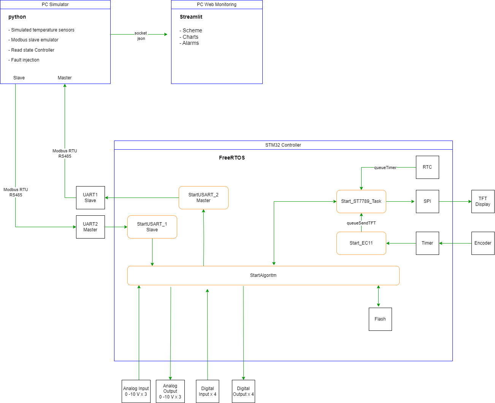

## Проект контроллера управления установками систем вентиляции и отопления

# 1. Общее описание

Проект:  HVAC_Controller

Цель проекта: Разработка контроллера управления наиболее распространенными вариантами ситем вентиляции и отопления. 

Область применения: Управление ситемами вентиляции и отопления.

Аппаратная платформа:  Разработанный контроллер управления HVAC_Controller на базе микроконтроллера stm32f101RCT6
		      1. Цифровые входы 			- 4 шт
		      2. Релейные выходы 			- 4 шт
                      3. Аналоговые входы 0 - 10В 	- 3 шт
                      4. Аналоговые выходы 0 - 10В	- 3 шт
                      5. Порт Modbus Master 		- 1 шт			
                      6. Порт Modbus Slave 		- 1 шт

Программное окружение:  CubeIDE 1.7.0, FreeRTOS v7.4.0

## Архетектура системы

