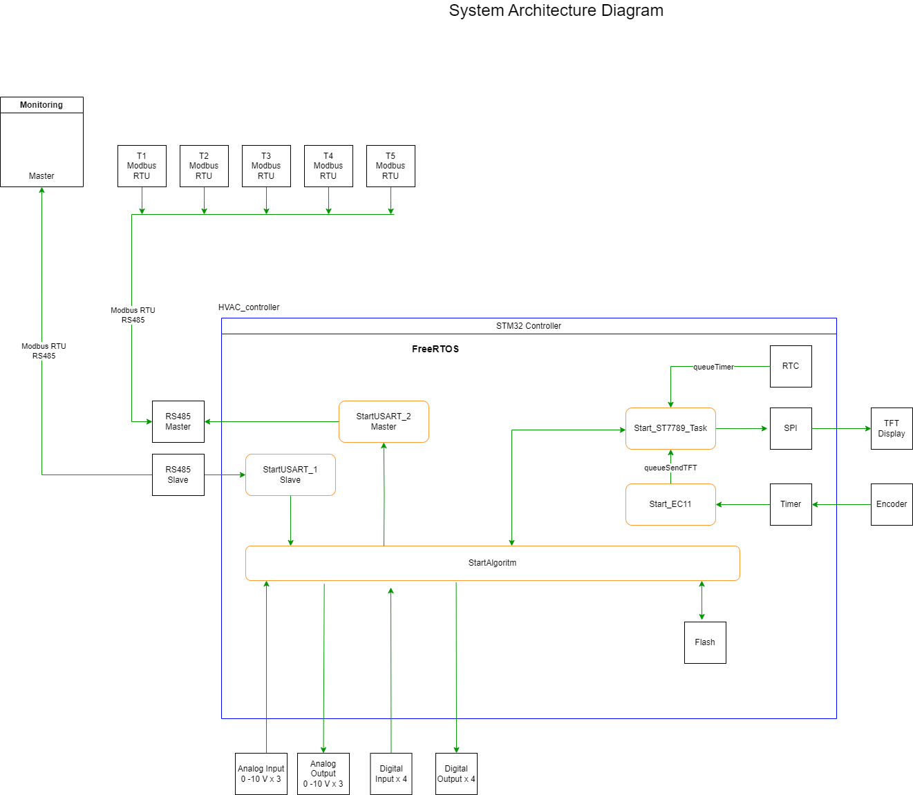

## Проект контроллера управления установками систем вентиляции и отопления

# 1. Общее описание

Проект:  HVAC_Controller

Цель проекта: Разработка контроллера управления наиболее распространенными вариантами ситем вентиляции и отопления. 

Область применения: Управление ситемами вентиляции и отопления.

Аппаратная платформа:  Разработанный контроллер управления HVAC_Controller на базе микроконтроллера stm32f101RCT6
		      - Цифровые входы 			- 4 шт
		      - Релейные выходы 		- 4 шт
                      - Аналоговые входы 0 - 10В 	- 3 шт
                      - Аналоговые выходы 0 - 10В	- 3 шт
                      - Порт Modbus Master 		- 1 шт			
                      - Порт Modbus Slave 		- 1 шт

Программное окружение:  CubeIDE 1.7.0, FreeRTOS v7.4.0

## Архетектура системы

## Архетектура ПО:
1. FreeRTOS
   1. Задачи:
      - Start_ST7789_Task - работа с дисплеем ST7789 RGB 240x240
      - Start_EC11- работа с энкодером EC-11
      - StartAlgoritm - алгоритм системы управления
      - StartUSART_1- работа с портом UART1 Slave
      - StartUSART_2- работа с портом UART2 Master

   2. Очереди:
      - queueTFT- очередь сообщений в дисплей
      - queueTimer - очередь статусов в экран от таймера

   3. Таймер:
      - UpdateValueTimer_Fun - тймер обновлений экрана

2. HAL

3. Библиотека ST7789
	- ST7789.c
	- fonts.c

## Описание модулей и функций
	

